# Javapos Service Object of lpu237

- Jpos device services of lpu237 Magnetic strip reader
- device io 는 windows 경우 tg_lpu237_dll.dll, 리눅스의 경우 libtg_lpu237_dll.so 를 사용
- IDE 는 vscode
- builder 는 gradle
- JDK 17
- 지원 OS win11 x86, x64, Debian12 x64

## 프로젝트 구조




## 디렉터리 구성

``` text
so.jpos.lpu237/
├── Source/pos-device-lpu237/     ← Eclipse Java 프로젝트 (소스)
│   └── src/kr/co/elpusk/javapos/msr/
│       ├── Lpu237MSRService.java           ← 핵심 서비스 구현
│       └── Lpu237ServiceInstanceFactory.java ← 인스턴스 팩토리
└── Release/javapos/              ← 배포 패키지
    ├── jposlib/                  ← JavaPOS 공통 라이브러리 (jpos114.jar 등)
    ├── lpu237lib/
    │   ├── JposLpu237MsrSO.jar  ← 빌드 결과물
    │   ├── x86/ tg_lpu237_*.dll
    │   └── x64/ tg_lpu237_*.dll
    └── TestSample/               ← 테스트 코드 및 배치 파일
```

## 핵심 클래스 역할

Lpu237MSRService — 전체 서비스의 핵심

|항목|내용|
|---|---|
|구현 인터페이스|MSRService111 (JavaPOS 1.11), JposServiceInstance, Runnable|
|서비스 버전|deviceServiceVersion = 1011000 (v1.11.0)|
|Native 연동|JNI 메서드 선언 (lpu237_open, lpu237_close, lpu237_wait_read 등)|
|스레드 구조|단일 Worker Thread + Command Queue (cmd_start_wait)|
|콜백 진입점|lpu237CallbackReadDone() — C++ JNI DLL이 호출하는 static 메서드|
|카드 파싱|analysisCardData() — ISO 1/2/3 트랙에서 PAN, 이름, 유효기간 등 추출|

Lpu237ServiceInstanceFactory — Reflection으로 서비스 인스턴스 생성, jpos.xml의 serviceClass 속성을 읽어서 인스턴스화

## 주요 설계 특징

Static 필드 공유 패턴 — claimed, worker, out_iso1/2/3, self_cur 등이 모두 static. 즉 JVM 내에서 동시에 하나의 인스턴스만 활성화 가능한 설계입니다.

## JNI 콜백 흐름

``` text
C++ DLL → lpu237CallbackReadDone() [static]
         → self_cur(현재 인스턴스)로 데이터 복사
         → callbacks.fireDataEvent() 호출
         → EnQ(cmd_start_wait) 로 다음 대기 재시작
```

## 빌드 환경

- Gradle

## Target

- Target Bytecode : Java 8
- 지원 JVM : Java 8 이상
